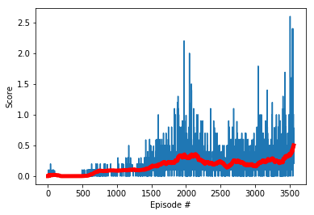

## Report
##### Learning Algorithm
First of all I decided to use my implementation of DDPG project and try to use two separate agents. This was little bit
unstable so I decided to try to implement MPDDPG agent. What is special is that actors  have only their own observation,
but critic sees observations of both. My implementation of Mddpg agent was originally just sharing replay buffer, 
but later I decided to experiment  little-bit and I moved critic out of the agents to stabilize the process.
Whole process was little bit slower than having agents with individual critics, but it is definitely  more 
stable and as you can see at image below, it converged in quite stable and safe way.  

Hyperparameters:
* BUFFER_SIZE = int(1e4)  
* BATCH_SIZE = 128     
* GAMMA = 0.99            
* TAU = 1e-3             
* ACTOR_LR =  1e-3      
* CRITIC_LR =  1e-3                
* UPDATE_EVERY = 4
* NUM_UPDATES = 3
* MU=0.
* THETA=0.15
* SIGMA=0.2
* NETWORK = 128/64 Both Actor and Critic have two linear layers with additional BatchNorm layer to stabilize training  

###### Notes about process 
* Smalled batch size, smaller network size, smaller update windows with smaller optimalization run counts worked better
than for Reacher environment. I was really suprised when I decided to decrease network size from 256/128 to 128/64) and got measurably better results*
* Notebook is not good environment to solve task like this. I had several issues/bugs with code caused essentially by how you can see things inside of browser,
solvable only after I went to IDE and checked everything in InteliJ IDEA.

*Environment was solved after 3460 episodes*

##### Future development
* I plan to compare sharing actor with sharing critic
* I would also like to investigate TRPO, PPO and A3C/ A2C in multi-agent environment
* I want to try to use AphaZero from lessons to solve something like this